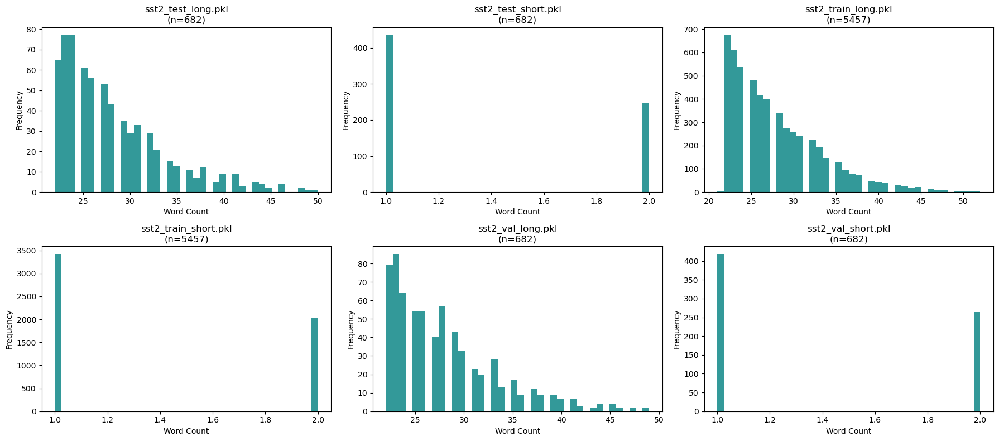

# Recurrent vs. Standard Transformers: Parameter and Compute-Efficient Classification Across Sentiment and Domains
**Team members**:Chenxi Guo, Jiayi Peng, Chaowei Wang, Junchen Han

# Abstract
Transformer models achieve strong performance in natural language processing but incur substantial computational and memory costs that scale with depth. This work investigates whether recurrent Transformers with shared weights can provide a more parameter-efficient alternative to standard encoder architectures for text classification. We conduct a controlled comparison between a conventional 6-layer Transformer baseline and recurrent variants that reuse a smaller set of layers through iterative refinement, isolating the effect of weight sharing under matched effective depth and shared architectural components.
Across sentiment classification and multi-domain review tasks, we evaluate parameter efficiency and robustness under varying data scales, input lengths, and domain shifts. Our results show that recurrent Transformers maintain competitive accuracy while substantially reducing parameter count, demonstrating favorable trade-offs between model capacity and efficiency. As a supplementary deployment-oriented analysis, we examine FP16 quantization and observe stable performance with further reductions in model size and inference latency. Together, these findings indicate that iterative recurrence can effectively substitute for depth stacking in encoder-based classification tasks, offering a practical path toward parameter-efficient Transformer deployment.

# Introduction
Transformer architectures dominate modern natural language processing, but their strong performance typically comes at the cost of large parameter counts and substantial computational overhead. As model depth increases, memory footprint, training cost, and inference latency grow rapidly, limiting the practicality of standard Transformers in resource-constrained or efficiency-sensitive settings. This motivates the study of parameter-efficient architectural alternatives that can preserve predictive performance while significantly reducing model size.

In this work, we investigate whether recurrent Transformers with shared weights can provide a more parameter-efficient substitute for standard Transformer encoders in text classification tasks. Rather than proposing a new architecture, our goal is to systematically analyze the trade-offs between standard and recurrent Transformers under controlled parameter budgets. We compare a conventional 6-layer Transformer baseline against recurrent variants that reuse a smaller set of layers through iterative refinement, isolating the effect of weight sharing on performance and efficiency. All models share identical modern components (Flash Attention, SwiGLU, RoPE, RMSNorm) to ensure that observed differences stem from architectural structure rather than implementation choices.

Beyond aggregate accuracy, we evaluate robustness across multiple stress settings, including reduced training data regimes, short versus long input sequences, and cross-domain generalization. For completeness, we additionally examine the effect of FP16 quantization on model size and inference latency, treating it as a deployment-oriented optimization rather than a primary modeling contribution. These experiments allow us to assess not only whether recurrent Transformers are parameter-efficient, but under what conditions such efficiency remains reliable. Our findings show that recurrent Transformers can maintain competitive performance with substantially fewer parameters across a range of realistic constraints, supporting their use as a practical and efficient alternative to standard Transformer encoders for classification tasks.

# Related Work
Recent advances in depth-recurrent transformer architectures offer a promising direction for model compression. The Universal Transformer [1] introduced the concept of applying the same transformation block iteratively, effectively trading parameters for computation. More recent work has extended this idea: the Mixture-of-Recursions (MoR) framework [2] combines parameter sharing with adaptive computation, dynamically allocating depth per token. Similarly, the Tiny Recursive Model (TRM) [5] demonstrates that a compact ~7M parameter network with recursive reasoning can outperform much larger models on complex tasks like ARC-AGI benchmarks.

These developments are particularly relevant in the context of reasoning-intensive tasks, where deeper processing has been shown to improve performance. By reusing layers across multiple iterations, recurrent transformers can achieve an effective depth that exceeds their physical layer count, enabling smaller models to develop richer representations without the parameter overhead of traditional deep networks.

Modern transformer implementations also benefit from architectural innovations such as Rotary Position Embedding (RoPE) [3], which encodes relative positional information directly into attention computations, and SwiGLU activation functions [4], which provide improved gradient flow through gated linear units. These components have become standard in efficient transformer designs.

# Methods

##  Theory
This section describes the core architectural components shared by our models. By strictly standardizing these modern components (RoPE, SwiGLU, RMSNorm), we ensure that observed performance differences arise solely from the architectural distinction (depth stacking vs. recurrence) rather than implementation discrepancies.

### Transformer Layer Formulation
Both models are built upon a standard pre-norm Transformer encoder layer. Given an input representation $\mathbf{h}_l \in \mathbb{R}^{d}$ at layer $l$, a single Transformer layer computes:

$$
\mathbf{h}'_l = \mathbf{h}_l + \mathrm{MHA}(\mathrm{Norm}(\mathbf{h}_l)),
$$

$$
\mathbf{h}_{l+1} = \mathbf{h}'_l + \mathrm{FFN}(\mathrm{Norm}(\mathbf{h}'_l)),
$$

where $\mathrm{MHA}$ denotes multi-head self-attention, $\mathrm{FFN}$ is a position-wise feed-forward network, and $\mathrm{Norm}$ corresponds to RMSNorm.

### Recurrent Transformer Formulation
The recurrent Transformer replaces depth stacking with iterative refinement using shared parameters. Let $\mathbf{h}^{(r)}$ denote the hidden state at recurrence step $r$. One recurrent iteration applies a stack of $N$ shared Transformer layers:

$$
\mathbf{h}^{(r+1)} = \mathcal{F}(\mathbf{h}^{(r)}) + \alpha \cdot \mathbf{h}^{(r)},
$$

where $\mathcal{F}$ represents the shared Transformer block and $\alpha$ is a residual scaling factor. After $R$ recurrence steps, the effective depth is $D_{\text{eff}} = N \times R$, allowing the model to match the representational depth of the baseline while using substantially fewer parameters.

### SwiGLU Feed-Forward Network
We adopt the SwiGLU activation to improve gradient flow. Given input $\mathbf{x}$, the feed-forward network is:

$$
\mathrm{FFN}(\mathbf{x}) = \mathbf{W}_3 \big( \mathrm{SiLU}(\mathbf{W}_1 \mathbf{x}) \odot (\mathbf{W}_2 \mathbf{x}) \big),
$$

where $\odot$ denotes element-wise multiplication. SwiGLU's gating mechanism improves representation capacity compared to standard GELU-based FFNs.

### Rotary Positional Embeddings (RoPE)

To encode positional information, we apply RoPE to query and key vectors by rotating each 2D feature pair. For position $m$ and pair index $i$, define the frequency
$$
\theta_i = 10000^{-2i/d}.
$$

Let $\mathbf{x}_{m,i} = \begin{bmatrix} x_{m,2i} \\ x_{m,2i+1} \end{bmatrix}$. RoPE applies a rotation:
$$
\mathbf{x}'_{m,i} =
\begin{bmatrix}
\cos(m\theta_i) & -\sin(m\theta_i) \\
\sin(m\theta_i) & \cos(m\theta_i)
\end{bmatrix}
\mathbf{x}_{m,i}.
$$

This induces relative-position attention behavior, so attention scores depend primarily on the offset $(n-m)$ rather than absolute positions.

### RMS Normalization
We use RMSNorm for computational efficiency. Given input $\mathbf{x} \in \mathbb{R}^d$:

$$
\mathrm{RMSNorm}(\mathbf{x}) = \frac{\mathbf{x}}{\sqrt{\frac{1}{d} \sum_{i=1}^{d} x_i^2 + \epsilon}} \cdot \gamma,
$$

where $\gamma$ is a learnable scale parameter. RMSNorm maintains training stability while reducing overhead by omitting mean-centering.

### Loss Function for Optimization Objective

We optimize both models using the standard Cross-Entropy loss. Given a dataset $\mathcal{D} = \{(x_i, y_i)\}_{i=1}^N$, where $x_i$ is the input sequence and $y_i$ is the ground truth label, the training objective is to minimize:

$$
\mathcal{L}(\theta) = -\frac{1}{N} \sum_{i=1}^N \sum_{c=1}^C \mathbb{1}(y_i = c) \log P(c | x_i; \theta)
$$

where $C$ is the number of classes, $\mathbb{1}(\cdot)$ is the indicator function, and $P(c | x_i; \theta)$ is the probability predicted by the model (after Softmax).

## Model Architectures
We evaluate two encoder-only transformer architectures designed to isolate the effect of iterative recurrent refinement versus standard depth stacking. Both models utilize identical architectural components—Flash Attention, SwiGLU feed-forward networks, rotary positional embeddings (RoPE), and RMSNorm—to ensure a controlled comparison.

### Baseline Transformer

The baseline follows a conventional pre-norm transformer encoder with 6 layers and a hidden dimensionality of 384. Table 1 summarizes the architectural configuration.

<!-- \begin{center}
{\small \textbf{Table 4. Baseline Transformer Configuration}}
\end{center} -->
Table 4. Baseline Transformer Configuration

| Component | Value |
|----------|-------|
| Number of layers | 6 |
| Hidden dimension | 384 |
| Attention heads | 6 |
| FFN intermediate size | 1536 |
| Total parameters | 26M |

Each layer consists of a multi-head self-attention block followed by a feed-forward network (FFN), both wrapped with pre-norm residual connections:

$$
\begin{aligned}
h'_l &= h_{l-1} + \mathrm{MHA}(\mathrm{Norm}_1(h_{l-1})) \\
h_l &= h'_l + \mathrm{FFN}(\mathrm{Norm}_2(h'_l))
\end{aligned}
$$

Classification is performed using the final hidden state corresponding to the [CLS] token [6]:

$$
\hat{y} = \mathrm{softmax}(W_c \, h_L[0])
$$

### Recurrent Transformer

The recurrent architecture employs iterative refinement to achieve an effective depth comparable to the baseline while using substantially fewer parameters. Instead of stacking 6 distinct layers, the model uses 3 shared layers unrolled for 2 iterations.

<!-- \begin{center}
{\small \textbf{Table 5. Recurrent Transformer Configuration}}
\end{center} -->
Table 5. Recurrent Transformer Configuration

| Component | Value |
|----------|-------|
| Physical layers | 3 |
| Recurrent iterations | 2 |
| Hidden dimension | 256 |
| Attention heads | 4 |
| FFN intermediate size | 1024 |
| Total parameters | 11M |

Let $h^{(r)}$ denote the hidden representation at iteration $r$. Each iteration applies the same 3-layer block:

$$
h^{(r+1)} = F(h^{(r)}) + \alpha \, h^{(r)}, \quad \alpha = 0.5
$$

Although only 3 layers are instantiated, the effective depth equals:

$$
D_{\mathrm{eff}} = N_{\mathrm{layers}} \times N_{\mathrm{iterations}} = 6
$$

This design follows prior iterative-refinement encoder models and enables parameter-efficient depth scaling.

### Rationale for Fixed Configurations

To ensure a meaningful and controlled comparison, architectural hyperparameters are held constant across both models:

1. Effective depth equivalence: Both architectures achieve a depth of 6 transformer layers.
2. Controlled parameter budget: The recurrent model reduces parameters by approximately 58% while maintaining comparable representational depth.
3. Consistent scaling principles: Both models use a 4× FFN expansion ratio and standard head dimensionality.

This controlled setup isolates the architectural contribution of recurrence, allowing us to analyze performance differences independent of model capacity.

### Shared Architectural Components

1. Flash Attention for memory-efficient attention computation  
2. SwiGLU feed-forward networks  
3. Rotary Positional Embeddings (RoPE)  
4. RMSNorm for stable pre-norm training dynamics  

By controlling for these components, any observed performance differences can be attributed primarily to the structural distinction between stacked depth and recurrent iterative depth.

## Datasets Overview

To assess the generalization capability and computational efficiency of the recurrent transformer architecture, three sentiment classification datasets were employed: the Stanford Sentiment Treebank (SST-2), Yelp Reviews, and a composite Multi-Domain corpus. These datasets collectively span short-sequence, long-sequence, and cross-domain linguistic settings. For comparability, all datasets were standardized to identical training, validation, and test sizes (54,576 / 6,822 / 6,823).

### Dataset Characteristics

#### SST-2 (Short-Sequence Domain)

SST-2 consists of concise movie review excerpts, with sequence lengths concentrated between 0 and 50 tokens. This dataset emphasizes sentiment cues embedded in short syntactic patterns. Label distributions across all splits exhibit a mild positive skew.

<!-- \begin{center}
{\small \textbf{Table 1. SST-2 Label Distribution}}
\end{center} -->
Table 1. SST-2 Label Distribution

| Split | Label 0 (%) | Label 1 (%) | n |
|-------|-------------|-------------|---------|
| Train | 44.11 | 55.89 | 54,576 |
| Validation | 44.91 | 55.09 | 6,822 |
| Test | 45.04 | 54.96 | 6,823 |

#### Yelp Reviews (Long-Sequence Domain)

Yelp reviews include substantially longer paragraphs, with some sequences reaching approximately 1,000 tokens. This dataset enables evaluating the model’s ability to capture long-range dependencies. The class distribution is nearly symmetric, minimizing confounding effects arising from label imbalance.

<!-- \begin{center}
{\small \textbf{Table 2. Yelp Label Distribution}}
\end{center} -->
Table 2. Yelp Label Distribution

| Split | Label 0 (%) | Label 1 (%) | n |
|-------|-------------|-------------|---------|
| Train | 50.08 | 49.92 | 54,576 |
| Validation | 51.28 | 48.72 | 6,822 |
| Test | 51.08 | 48.92 | 6,823 |

#### Multi-Domain Dataset (Composite Setting)

This dataset integrates samples drawn from local business reviews, movie reviews, and online shopping reviews. Category proportions were strictly controlled to maintain balanced domain representation across splits. Text lengths span a wide range, including many long sequences.

<!-- \begin{center}
{\small \textbf{Table 3. Multi-Domain Category Distribution}}
\end{center} -->
Table 3. Multi-Domain Category Distribution

| Split | Local business (%) | Movie review (%) | Online shopping (%) | n |
|-------|---------------------|------------------|----------------------|---------|
| Train | 33.33 | 33.33 | 33.33 | 54,576 |
| Validation | 33.33 | 33.33 | 33.33 | 6,822 |
| Test | 33.33 | 33.33 | 33.33 | 6,823 |

# Experiments and Results

## Training Protocol
We implemented all models using PyTorch and trained them under identical conditions to ensure a fair comparison. The specific protocol is as follows, and the same training strategy is applied consistently across all experiments and data subsets.

1. Optimization Configuration  

We utilize the AdamW optimizer with an initial learning rate of $3 \times 10^{-5}$ and a batch size of 16. To maintain training stability and prevent gradient explosion, particularly in the recurrent layers, we apply gradient clipping with a maximum norm of 1.0.

1. Adaptive Scheduling  

To facilitate convergence, we employ a ReduceLROnPlateau scheduler. The learning rate is dynamically decayed by a factor of 0.5 whenever the validation loss fails to improve for 2 consecutive epochs.

1. Early Stopping and Model Selection  

We implement early stopping to prevent overfitting, terminating training if validation loss does not improve by a margin of $10^{-3}$ for 3 consecutive epochs. The final evaluation uses the model checkpoint that achieved the lowest validation loss, rather than the final training state.

### Evaluation Methodology

We evaluate all models on the held-out test set to assess both predictive performance and efficiency. Evaluation focuses on three aspects: classification performance, parameter efficiency, and inference latency. Predictive performance is measured using Accuracy, Precision, Recall, and F1-score. Parameter efficiency is quantified by the total number of trainable parameters and model size (MB, assuming 32-bit precision). Inference efficiency is assessed by the average per-sample inference time (in milliseconds) over the full test set, capturing the runtime impact of recurrent unrolling relative to standard depth stacking.

## Experimental Design and Results

### SST-2 Benchmark Evaluation (Full Dataset)

We evaluate the baseline transformer and the recurrent transformer on the full SST-2 dataset to examine their predictive performance, parameter efficiency, and inference characteristics. Table 1 summarizes the quantitative results, while Figure 1 illustrates the accuracy–latency trade-off, with bubble size representing overall model storage cost.

The baseline transformer achieves the strongest predictive performance, reaching an accuracy of 0.9061 and an F1 score of 0.9148. In comparison, the recurrent transformer attains a slightly lower accuracy (0.9021) and F1 score (0.9100), indicating a modest performance trade-off. However, this degradation is small relative to the substantial reduction in model size.

Specifically, the recurrent model uses less than half the parameters of the baseline (11.0M vs. 25.9M) and reduces storage requirements by more than 55% (41.9 MB vs. 98.8 MB), while maintaining comparable inference latency (0.3595 ms vs. 0.3706 ms). Precision–recall analysis further reveals that the recurrent model exhibits higher precision but lower recall, suggesting a more conservative decision boundary.

Overall, these results demonstrate that the recurrent transformer offers a favorable efficiency–performance trade-off: while the baseline model remains superior in absolute accuracy, recurrent depth-sharing enables substantial parameter and memory savings with only a minor reduction in predictive quality on short-sequence sentiment classification tasks such as SST-2.

<!-- \begin{center}
{\small \textbf{Table 6. SST-2 Benchmark Performance}}
\end{center} -->
Table 6. SST-2 Benchmark Performance

| Model      | Parameters | Size (MB) | Accuracy | F1     | Precision | Recall | Inference (ms) |
|------------|------------|-----------|----------|--------|-----------|--------|----------------|
| Baseline   | 25,912,706 | 98.85     | 0.9061   | 0.9148 | 0.9174    | 0.9122 | 0.3706         |
| Recurrent  | 10,972,162 | 41.86     | 0.9021   | 0.9100 | 0.9250    | 0.8955 | 0.3595         |

### Data Size Sensitivity (50% / 10% SST-2)

### Length-Based Sensitivity (Short vs Long on SST-2)

To study how input length influences model performance, we extract the shortest 30% and longest 30% of SST-2 samples and train each model separately on short-only and long-only subsets. The distributions shown in Figure 3 illustrate a clear separation between the two regimes: short subsets contain predominantly 1–2 token sequences, whereas long subsets span 20–50 tokens and exhibit substantially higher lexical diversity.

<!-- \begin{center}
{\small \textbf{Figure 3. Word Count Distributions for Short and Long SST-2 Subsets}}
\end{center} -->
Figure 3. Word Count Distributions for Short and Long SST-2 Subsets  
{width=90%}

Model performance on the long-text subset is summarized in Table 9. Despite using fewer than half the parameters, the recurrent transformer slightly outperforms the baseline in accuracy and yields noticeably higher F1 and recall. This suggests that recurrent depth-sharing provides an advantage when modeling extended contextual dependencies. Although its inference latency is marginally higher, the improvement in predictive performance combined with a significantly smaller model footprint indicates a favorable efficiency–performance trade-off.

<!-- \begin{center}
{\small \textbf{Table 9. Long-Sequence SST-2 Subset Performance}}
\end{center} -->
Table 9. Long-Sequence SST-2 Subset Performance

| Model      | Parameters | Size (MB) | Accuracy | F1     | Precision | Recall | Inference (ms) |
|------------|------------|-----------|----------|--------|-----------|--------|----------------|
| Baseline   | 25,912,706 | 98.85     | 0.8666   | 0.8679 | 0.9144    | 0.8260 | 0.3115         |
| Recurrent  | 10,972,162 | 41.86     | 0.8710   | 0.8795 | 0.8723    | 0.8867 | 0.3920         |

On the short-only subset (1–2 token inputs), both models show reduced performance due to the absence of contextual structure. The baseline attains slightly higher accuracy, while the recurrent model achieves higher recall with nearly identical F1 scores, indicating that under minimal context, the two architectures behave similarly and differ mainly in precision–recall trade-offs.

<!-- \begin{center}
{\small \textbf{Table 10. Short-Sequence SST-2 Subset Performance}}
\end{center} -->
Table 10. Short-Sequence SST-2 Subset Performance

| Model      | Parameters | Size (MB) | Accuracy | F1     | Precision | Recall | Inference (ms) |
|------------|------------|-----------|----------|--------|-----------|--------|----------------|
| Baseline   | 25,912,706 | 98.85     | 0.7610   | 0.7739 | 0.7971    | 0.7520 | 0.2985         |
| Recurrent  | 10,972,162 | 41.86     | 0.7522   | 0.7732 | 0.7701    | 0.7763 | 0.2959         |

### Cross-Domain Architectural Consistency Analysis on Yelp

### Multi-Domain Review Classification (3-class)
We extend our evaluation to a three-class domain classification task (Movie, Yelp, Amazon) to assess whether the models can distinguish stylistic and distributional differences across review sources, beyond simple sentiment polarity. By matching each domain’s data size to SST-2, this setting provides a balanced and more challenging multi-class benchmark for comparing the Baseline and Recurrent Transformers, offering clearer insight into architectural differences.

Both models achieve near-perfect performance on the multi-domain three-class task, with the recurrent transformer showing a slight but consistent improvement in accuracy and F1, as summarized in Table 12.

<!-- \begin{center}
{\small \textbf{Table 12. Multi-Domain 3-Class Classification Results}}
\end{center} -->
Table 12. Multi-Domain 3-Class Classification Results

| Model      | Parameters | Size (MB) | Accuracy | F1     | Precision | Recall | Inference (ms) |
|------------|------------|-----------|----------|--------|-----------|--------|----------------|
| Baseline   | 25,913,091 | 98.85     | 0.9840   | 0.9840 | 0.9841    | 0.9840 | 0.3304         |
| Recurrent  | 10,972,419 | 41.86     | 0.9865   | 0.9865 | 0.9865    | 0.9865 | 0.3228         |

### Supplementary Deployment Analysis: Precision and Quantization Effects

To evaluate deployment characteristics, we compare model architectures and numerical precision with an emphasis on memory footprint, inference latency, and robustness to FP16 quantization. The Recurrent-Light (Benchmark, hidden size = 256) model serves as the primary reference, as it matches the recurrent configuration used in the main experiments. The Baseline (Benchmark) employs a standard 6-layer transformer with matched effective depth, providing a consistent non-recurrent comparison.

In addition, we include a Recurrent (Wider, hidden size = 384) variant as an auxiliary experiment. This configuration is not part of the benchmark comparison and is introduced solely to isolate the effect of recurrent weight sharing under FP16 quantization while controlling for representational width. Together, these settings disentangle architectural form, capacity, and numerical precision in a deployment-focused evaluation.

#### Experimental Configurations

We evaluate three model families, each under FP32 and FP16 precision:

1. Baseline Transformer (Benchmark)
   A standard 6-layer transformer with hidden size = 384, serving as the non-recurrent reference architecture.

2. Recurrent Transformer (Wider Variant) 
   A recurrent transformer with depth sharing (3 layers iterated twice, effective depth = 6) and hidden size = 384, introduced to assess quantization robustness under matched capacity.

3. Light-Recurrent Transformer (Benchmark)
   A parameter-efficient recurrent transformer with depth sharing and reduced width (hidden size = 256), representing the main experimental configuration and deployment benchmark.

#### Quantitative Results

<!-- \begin{center}
{\small \textbf{Table 13. Deployment Performance Comparison under FP32 and FP16 Precision.}}
\end{center} -->
Table 13. Deployment Performance Comparison under FP32 and FP16 Precision

| Model (Configuration) | Precision | Parameters | Size (MB) | Accuracy | F1 | Precision | Recall | Inference (ms) |
|-----------------------|-----------|------------|-----------|----------|----|-----------|--------|----------------|
| Baseline (Benchmark) | FP32 | 25.9M | 98.85 | 0.9022 | 0.9125 | 0.9036 | 0.9215 | 0.411 |
| Baseline (Benchmark) | FP16 | 25.9M | 49.42 | 0.9021 | 0.9123 | 0.9034 | 0.9213 | 0.246 |
| Recurrent (Wider) | FP32 | 18.8M | 71.78 | 0.9100 | 0.9182 | 0.9226 | 0.9138 | 0.405 |
| Recurrent (Wider) | FP16 | 18.8M | 35.89 | 0.9100 | 0.9180 | 0.9221 | 0.9134 | 0.241 |
| Recurrent-Light (Benchmark) | FP32 | 11.0M | 41.86 | 0.8977 | 0.9082 | 0.9017 | 0.9146 | 0.403 |
| Recurrent-Light (Benchmark) | FP16 | 11.0M | 20.93 | 0.8977 | 0.9082 | 0.9017 | 0.9146 | 0.230 |

Under the benchmark configuration, the Recurrent-Light (Benchmark) model exhibits a modest reduction in accuracy compared to the Baseline (Benchmark) transformer (0.8977 vs. 0.9022), reflecting an intentional trade-off between capacity and efficiency. This performance difference is small relative to the deployment benefits: the Recurrent-Light (Benchmark) model uses less than half the parameters (11.0M vs. 25.9M) and achieves nearly an 80% reduction in storage under FP16 precision (20.9 MB vs. 98.9 MB), while maintaining comparable inference latency. Across all architectures, FP16 quantization proves highly stable, preserving accuracy and F1 while reducing model size by approximately 50% and improving inference speed by 40–45%. Moreover, the Recurrent (Wider, hidden size = 384) model outperforms the Baseline (Benchmark) under matched width, confirming that recurrent weight sharing is not inherently limiting. Overall, these results indicate that recurrent transformers, particularly the Recurrent-Light (Benchmark) configuration with FP16 precision, offer an attractive deployment-efficient alternative with minimal impact on predictive performance.

## Conclusion

### Key Findings

### Limitations

### Future Directions

## References

[1] Dehghani, M., Gouws, S., Vinyals, O., Uszkoreit, J., & Kaiser, Ł. (2018). Universal Transformers. *arXiv preprint arXiv:1807.03819*.

[2] Anonymous. (2025). Mixture-of-Recursions: Learning Dynamic Recursive Depths for Adaptive Token-level Computation. *arXiv preprint arXiv:2507.10524*.

[3] Su, J., Lu, Y., Pan, S., Murtadha, A., Wen, B., & Liu, Y. (2021). RoFormer: Enhanced Transformer with Rotary Position Embedding. *arXiv preprint arXiv:2104.09864*.

[4] Shazeer, N. (2020). GLU Variants Improve Transformer. *arXiv preprint arXiv:2002.05202*.

[5] Jolicoeur-Martineau, A., et al. (2025). Less is More: Recursive Reasoning with Tiny Networks. *arXiv preprint arXiv:2510.04871*.

[6] Devlin, J., Chang, M. W., Lee, K., & Toutanova, K. (2019). BERT: Pre-training of Deep Bidirectional Transformers for Language Understanding. *Proceedings of NAACL-HLT 2019*, 4171-4186.